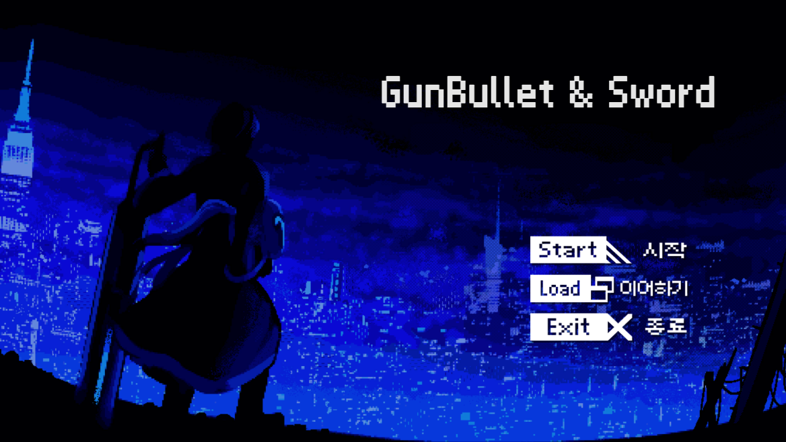
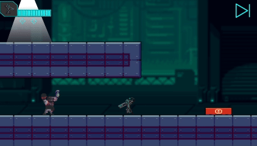
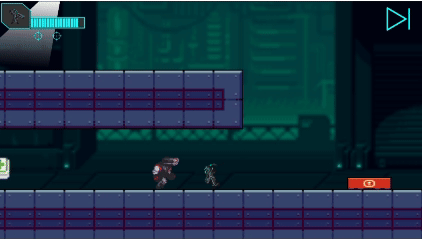
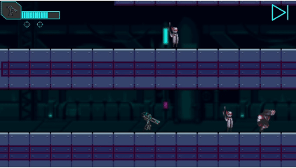
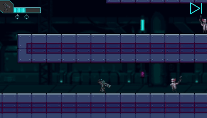
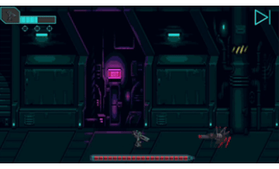
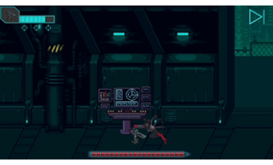
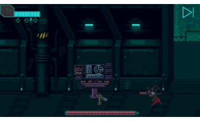

# GUN-BULLET&SWORD



2D 횡스크롤 액션 유니티 프로젝트입니다.  
검과 총을 함께 사용하는 플레이어가 튜토리얼, 잠입 구간, 일반 스테이지, 보스전을 거쳐 목표를 달성하는 구조로 작성되어 있습니다.

> 일부 에셋 경우 외부 에셋을 가져왔기 때문에 저장소에는 에셋을 제외하였습니다. 따라서 저장소로부터 받은 파일은 빌드가 불가능합니다. 대신에 시연 영상 링크를 올리겠습니다.


## 프로젝트 개요

- 엔진: Unity `2021.3.6f1`
- 장르: 2D 횡스크롤 액션 / 스토리 진행형 스테이지 게임
- 주요 기능:
  - 근접 콤보 공격, 방향 입력 기반 특수 공격, 원거리 사격
  - 대화형 상호작용(`G`)
  - Timeline 기반 연출
  - 스테이지 진행 저장 / 불러오기
  - 일반 적, 튜토리얼 적, 보스전 구성


## 담당한 부분

### 튜토리얼
  - `TutorialManager.cs`
    - 튜토리얼 단계 관리

    

### Player 설계

- `Player.cs`
  - 일반 스테이지용 플레이어 컨트롤
  - 이동, 점프, 공격, 피격, 상호작용 처리
- `TutorialPlayer.cs`
  - 튜토리얼 진행 상태에 따라 조작을 단계적으로 해금
- `HomePlayer.cs`
  - `PlayerHome` 전용 플레이어 컨트롤

### 적 AI

- `Enemy.cs`
  - 적 공통 베이스 클래스 설계

- `HeadMachine.cs`
  - 수류탄 투척

    

  - 잡기 공격

    

- `ArmMachine.cs`
  - 조준 후 사격

    

  - 근접 칼 공격 

    

- `BossMonster.cs`
  - 돌진 공격

    

  - 잡기 공격

    

  - 조준 후 사격

    


<br>

## 폴더 구조

```text
Assets/
  MyScripts/        게임 로직 스크립트
  Scenes/           씬 파일
  MySprites/        스프라이트 리소스
  MyPrefeb/         프리팹
  MyTimelines/      Timeline 리소스
```


## 씬 구성

1. `TitleScene`
2. `TutorialScene`
3. `PlayerHome`
4. `Stage1`
5. `Stage2`
6. `Stage3`


### 씬 흐름

- `TitleScene`
  - 새 게임 / 불러오기 / 종료 메뉴
- `TutorialScene`
  - 기본 이동, 점프, 상호작용, 공격 조작을 순차적으로 학습
- `PlayerHome`
  - 대화 및 연출 진행 후 본 스테이지 진입
- `Stage1`
  - 일반 전투 구간
  - 적 처치 후 카드 키를 획득하고 엘리베이터를 통해 다음 스테이지로 이동
- `Stage2`
  - 제한 시간이 있는 구간
  - 제한 시간 안에 좌측 최상단 컴퓨터와 상호작용을 하여 클리어하고 다음 스테이지로 이동
- `Stage3`
  - 보스전
  - 보스 처치 후 테이블 조사, 문서 획득, 출구 포털로 엔딩 진행


## 조작법

### 기본 조작

- `A`, `D`: 좌우 이동
- `Space`: 점프
- `G`: 상호작용 / 대화 진행

### 전투 조작

- `좌클릭`: 기본 근접 공격
- `W + 좌클릭`: 상단 공격
- `E + 좌클릭`: 찌르기
- `우클릭`: 총 발사

### 전투 시스템 메모

- 플레이어는 근접 3연속 콤보를 사용
- 탄약은 최대 3발이며, 모두 사용하면 자동 재장전
- 일부 적은 잡기, 저격, 투척, 돌진 같은 패턴을 사용


## 핵심 시스템

### 1. 플레이어

- `Player.cs`
  - 일반 스테이지용 플레이어 컨트롤
  - 이동, 점프, 공격, 피격, 상호작용 처리
- `TutorialPlayer.cs`
  - 튜토리얼 진행 상태에 따라 조작을 단계적으로 해금
- `HomePlayer.cs`
  - `PlayerHome` 전용 플레이어 컨트롤

### 2. UI / 대화 / 연출

- `PlayerUICanvas.cs`
  - HP, 탄약 UI 관리
  - 대화 출력
  - Timeline 시작/종료 제어
- `ConversationObject.cs`
  - 대화 데이터 베이스 역할
- `PauseUICanvas.cs`
  - 일시정지 UI 제어

### 3. 게임 진행 / 저장
- `GameManager.cs`
  - 현재 진행 스테이지 저장
  - 새 게임 / 불러오기 / 저장 처리

- 저장 데이터:
  - 현재 스테이지 인덱스 1개를 JSON으로 저장

